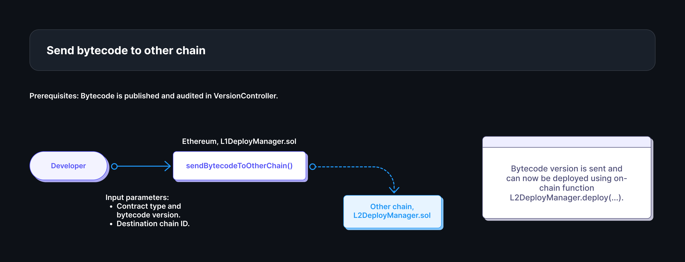
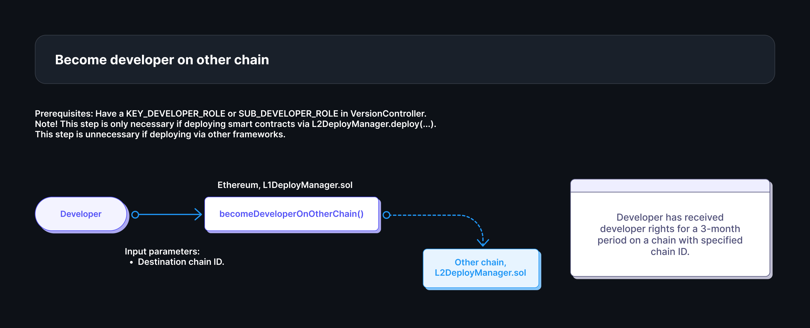
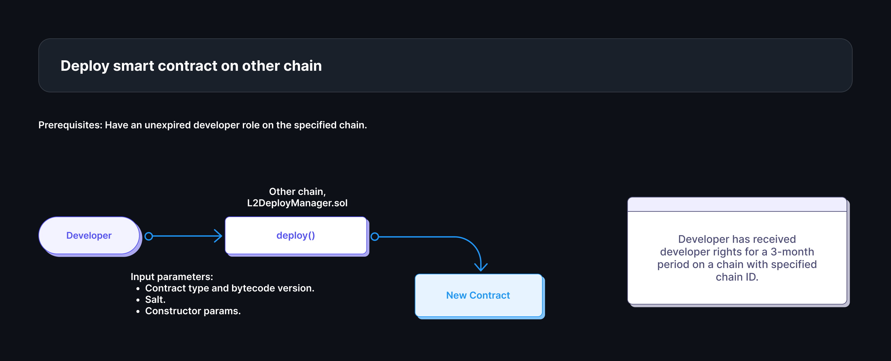
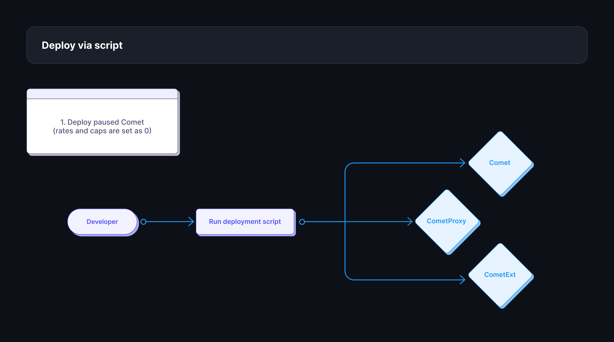
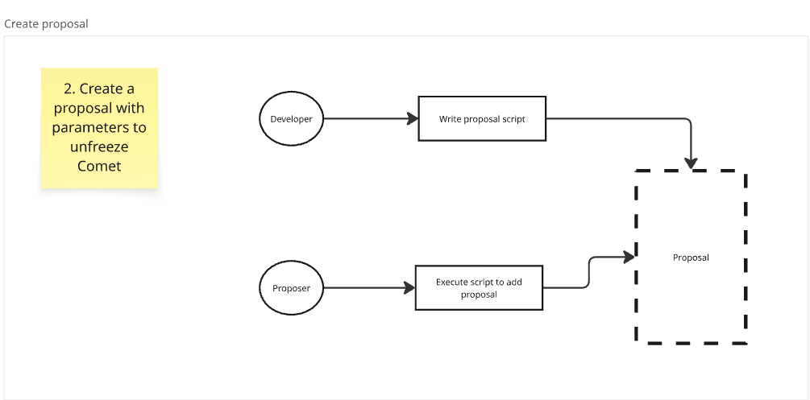
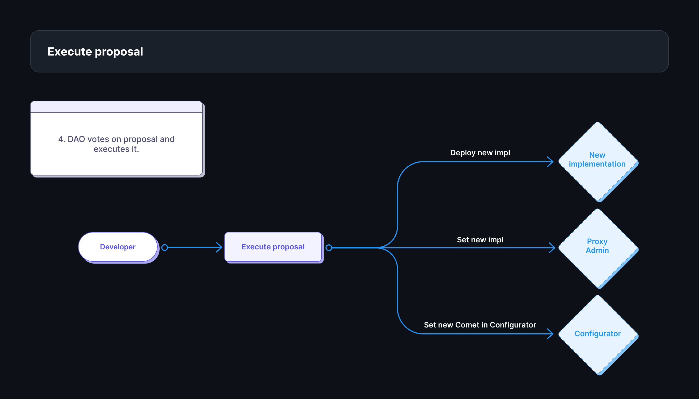
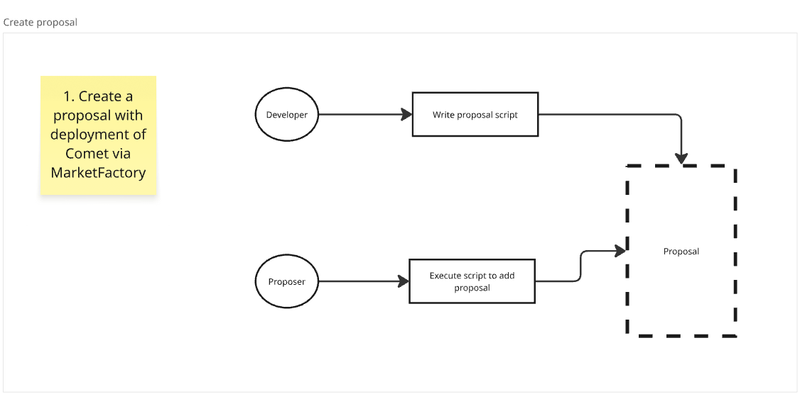
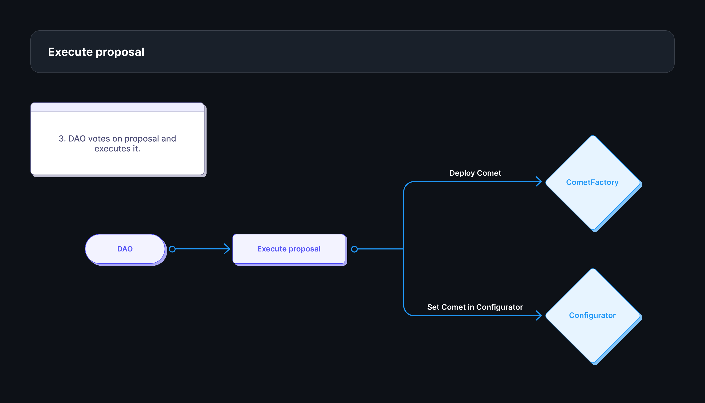

# BytecodeRepository

A cross-chain smart contract bytecode repository system that enables secure, versioned, and audited contract deployment across multiple networks using Chainlink CCIP.

## TL;DR

### Smart Contracts at a Glance

**🎯 VersionController** - The core smart contract of the system which manages developer and auditor roles, versioned storing of bytecode and retrieval of audited bytecodes for deployment.

- Version release of bytecodes for different contract types with semantic versioning
- Role-based access control with hierarchical permissions (Governor → Key Developer → Sub Developer)
- Audit verification system using EIP-712 cryptographic signatures
- Alternative version support for same base versions (e.g., "optimized", "minimal")
- SSTORE2-powered bytecode storage with 87% gas cost reduction vs traditional storage
- Sub-developer management (max 3 per key developer) for team scaling
- Contract type assignment system for specialized development workflows

**🚀 L1DeployManager** - L1 deployment orchestrator with cross-chain capabilities

- Direct CREATE2 deployment on Ethereum mainnet with deterministic addresses
- Chainlink CCIP integration for trustless cross-chain bytecode distribution
- Address pre-computation before deployment for predictable multi-chain addresses
- Only developers of ecosystem can deploy smart contracts via L1DeployManager

**📡 L2DeployManager** - L2 deployment receiver that ensures bytecode integrity

- CCIP message receiver for secure cross-chain bytecode synchronization
- SSTORE2-based storage system for gas-efficient bytecode persistence on L2s
- CREATE2 deployment matching L1 addresses for consistent multi-chain presence
- Factory integration for specialized contract types deployment (Comet, Market, etc.)
- Automatic bytecode validation and verification before storage
- Developers can request deployment access through L1DeployManager

**🏭 BaseFactory** - Abstract deployment factory with standardized patterns

- CREATE2 integration with deployer-specific salt generation for unique addresses
- Bytecode provider abstraction supporting both L1 and L2 deployment managers
- Standardized constructor parameter handling for consistent deployment patterns

**🌟 CometFactoryV2** - Specialized Compound Comet protocol deployment factory

- Domain-specific deployment logic optimized for Compound's Comet lending markets
- Custom parameter encoding and validation for Comet protocol requirements
- Seamless integration with Compound's governance and upgrade patterns

**📈 MarketFactory** - Market contract deployment factory with extended asset list support

- Specialized deployment patterns for Compound Comet market contracts with enhanced asset management
- Custom initialization logic for market-specific parameters and configurations
- Exclusively deploys CometExtWithAssetList and CometWithAssetList for enhanced collateral capacity
- Built-in validation for market deployment requirements and asset list factory integration

**💾 BytecodeStore** - Gas-optimized storage library using SSTORE2 magic

- 87% gas cost reduction by storing data as contract bytecode instead of storage slots
- Immutable bytecode storage

## Overview

BytecodeRepository is a cross-chain infrastructure that solves the fundamental challenge of deploying identical, audited smart contracts across multiple blockchain networks. At its core, it addresses critical problems in multi-chain development: **trust**, **consistency**, **efficiency**, and **governance**.

### The Problem Space

Traditional multi-chain deployment suffers from several critical issues:

1. **Trust Gap**: How do you verify that the same audited contract is deployed across different chains?
2. **Storage Inefficiency**: Smart contract bytecode can be large (>24KB), making on-chain storage prohibitively expensive
3. **Address Inconsistency**: Different deployment transactions result in different contract addresses across chains
4. **Governance Complexity**: Managing who can deploy what, where, and when across multiple networks
5. **Audit Redundancy**: Validation of the same smart contracts deployment to ensure that bytecode wasn't altered

### Core Functionality & Architecture

BytecodeRepository provides a **three-layer solution**:

**Layer 1 (Ethereum)**: Acts as the canonical source of truth

- **VersionController**: Manages bytecode versions, developer permissions, and audit verification
- **L1DeployManager**: Handles L1 deployments and initiates cross-chain bytecode distribution

**Layer 2 (Cross-chain)**: Secure bytecode transmission

- **Chainlink CCIP**: Provides cryptographically secure cross-chain messaging for bytecode distribution across multiple chains

**Layer 3 (L2 Networks)**: Bytecode reception and deployment

- **L2DeployManager**: Receives, stores, and deploys bytecode on destination networks ensuring bytecode integrity during deployments on different networks

### Distinguishing Technical Features

#### 1. SSTORE2-Based Bytecode Storage

**What it is**: A gas-optimized storage pattern that stores arbitrary data as contract bytecode rather than in storage slots.

**How it is used**: SSTORE2 is used for bytecode storage effectively decreasing gas costs for storing and providing data immutability.

#### 2. Chainlink CCIP Integration

**What it is**: Chainlink's Cross-Chain Interoperability Protocol for secure cross-chain messaging.

**How it is used**: CCIP is used for cross-chain distribution of bytecodes providing integrity of the code during cross-chain deployment.

**How it works**:

- L1DeployManager encodes bytecode and version information into CCIP messages.
- Messages are validated by Chainlink's Risk Management Network.
- L2DeployManager receives and validates messages before storing bytecode.

#### 3. CREATE2 Deterministic Deployment

**What it is**: A deployment method that generates predictable contract addresses based on deployer, salt, and bytecode hash.

**How it is used**: CREATE2 is used for every deployment via DeployManager smart contracts and Factories.

#### 4. EIP-712 Audit Verification

**What it is**: A standard for structured data signing that enables secure audit verification.

**How it is used**: EIP-712 is used for the bytecode verification. Authorized auditors can submit audit report along with the signature proving that the smart contracts passed audit and can be deployed.

### Unique Value Proposition

#### Multi-Chain Consistency

Unlike traditional deployment tools, BytecodeRepository ensures **cryptographic consistency**:

- Same bytecode hash deployed across all networks
- Same contract addresses via CREATE2
- Same audit verification for all deployments

#### Trustless Cross-Chain Operations

Chainlink CCIP provides security guarantees that surpass traditional bridges:

- No trusted intermediaries or multi-sig requirements
- Decentralized validation by proven oracle network
- Built-in protection against message replay and tampering

#### Governance-First Design

Role-based access control provides the Governance of the organization to maintain the list of developers and auditors:

- Hierarchical permissions (Governor → Key Developer → Sub Developer)
- Contract type specialization (developers assigned to specific contract categories)
- Audit verification requirements with signature

## Bytecode Lifecycle

Understanding the complete journey of smart contract bytecode through the BytecodeRepository system - from initial role assignment to multi-chain deployment.

### Phase 1: Governance Setup 🏛️

**Step 1: Role Assignment**

```solidity
// Governor grants key developer role and assigns key developers to specific contract types via proposal
bytes32 contractType = "Comet";
versionController.assignDeveloperForContractType(contractType, keyDeveloperAddress);

// Governor grants auditor roles
versionController.grantRole(AUDITOR_ROLE, auditorAddress);
```

**Step 2: Cross-chain Configuration**

```solidity
// Configure L2 networks for bytecode distribution
ChainConfig memory arbitrumConfig = ChainConfig({
    isEnabled: true,
    l2DeployManager: arbitrumL2DeployManagerAddress,
    chainSelector: arbitrumCCIPSelector
});
l1DeployManager.setChainConfig(42161, arbitrumConfig); // Arbitrum
```

### Phase 2: Development & Upload 💻

**Key Developer Workflow**

**Step 1: Bytecode Preparation**

```solidity
// Developer compiles their smart contract
bytes memory cometBytecode = abi.encodePacked(vm.getCode("Comet.sol"));

// Prepare bytecode input with metadata
BytecodeInput memory input = BytecodeInput({
    contractType: "Comet",
    initCode: cometBytecode,
    sourceURL: "https://github.com/compound-finance/comet/releases/v1.2.0"
});
```

**Step 2: Version Release Strategy**

The VersionController uses distinct functions for different types of version releases, following semantic versioning principles:

```solidity
// 🚀 INITIAL RELEASE - First bytecode upload for a contract type
// Always creates version 1.0.0
versionController.releaseBytecode(input);
// Result: Creates version 1.0.0 for this contract type
```

```solidity
// 📈 MAJOR VERSION - Breaking changes, new architecture
// Increments major version, resets minor and patch to 0
versionController.releaseMajorVersion(input);
// Example: 1.2.3 → 2.0.0 (breaking changes, new features)
```

```solidity
// 🔧 MINOR VERSION - New features, backward compatible
// Increments minor version for specific major version, resets patch to 0
uint64 majorVersion = 1; // Target major version
versionController.releaseMinorVersion(input, majorVersion);
// Example: 1.2.3 → 1.3.0 (new features, backward compatible)
```

```solidity
// 🐛 PATCH VERSION - Bug fixes, backward compatible
// Increments patch version for specific major.minor version
uint64 majorVersion = 1;
uint64 minorVersion = 2;
versionController.releasePatchVersion(input, majorVersion, minorVersion);
// Example: 1.2.3 → 1.2.4 (bug fixes, security patches)
```

```solidity
// 🎯 ALTERNATIVE VERSION - Same functionality, different optimization
// Creates alternative version of existing base version
VersionWithAlternative memory altVersion = VersionWithAlternative({
    version: Version({major: 1, minor: 0, patch: 0}),
    alternative: "gas-optimized" // or "minimal", "extended", etc.
});
versionController.releaseAlternativeVersion(input, altVersion);
// Creates: 1.0.0-gas-optimized alongside existing 1.0.0
```

**Version Release Example:**

```solidity
// Development timeline for "Comet" contract type:

// Day 1: Initial release
versionController.releaseBytecode(cometInput);
// ✅ Created: 1.0.0

// Day 30: Bug fix
versionController.releasePatchVersion(cometInput, 1, 0);
// ✅ Created: 1.0.1

// Day 60: New feature (collateral support)
versionController.releaseMinorVersion(cometInput, 1);
// ✅ Created: 1.1.0

// Day 90: Gas-optimized variant
VersionWithAlternative memory gasOpt = VersionWithAlternative({
    version: Version(1, 1, 0),
    alternative: "gas-optimized"
});
versionController.releaseAlternativeVersion(cometInput, gasOpt);
// ✅ Created: 1.1.0-gas-optimized

// Day 120: Major rewrite with new architecture
versionController.releaseMajorVersion(cometInput);
// ✅ Created: 2.0.0
```

**Version Strategy Guidelines:**

- **Patch (x.y.Z)**: Security fixes, bug corrections, documentation updates
- **Minor (x.Y.0)**: New features, additional functionality, performance improvements
- **Major (X.0.0)**: Breaking changes, architecture rewrites, incompatible updates
- **Alternative (x.y.z-variant)**: Same functionality with different trade-offs (gas vs features)

**Sub-Developer Workflow**

```solidity
// Key developer adds sub-developers (max 3)
versionController.addSubDeveloper(subDeveloperAddress);

// Sub-developer can now upload bytecode for assigned contract types
// Same process as key developer, but limited to their key dev's contract types
```

### Phase 3: Audit & Verification 🔍

**Step 1: Auditor Review Process**

```typescript
// Auditor retrieves bytecode for review
const bytecodeHash = await versionController.computeBytecodeHash(
  contractType,
  version,
);
const bytecode = await versionController.getBytecode(bytecodeHash);

// Conduct comprehensive security audit...
// Generate audit report and publish (for example, to IPFS/Arweave)
const auditReportURL = "https://audits.firm.com/comet-v2.1.0-report.pdf";
```

**Step 2: EIP-712 Signature Generation**

```typescript
// Create structured audit data
const auditData = {
  bytecodeHash: bytecodeHash,
  auditReport: auditReportURL,
};

// EIP-712 domain for VersionController
const domain = {
  name: "VersionController",
  version: "1",
  chainId: 1, // Ethereum mainnet
  verifyingContract: versionController.address,
};

// EIP-712 type definition
const types = {
  AuditReport: [
    { name: "bytecodeHash", type: "bytes32" },
    { name: "auditReport", type: "string" },
  ],
};

// Generate cryptographic signature
const signature = await auditor._signTypedData(domain, types, auditData);
```

**Step 3: Audit Submission**

```solidity
// Developers can submit audit verification provided by auditors on-chain
versionController.verifyAudit(
    bytecodeHash,
    auditReportURL,
    signature
);

// Multiple auditors can verify the same bytecode
// System tracks all audit signatures and reports
// At least one signature is sufficient to allow deployment of the bytecode
```

### Phase 4: Cross-chain Distribution 🌐

**Step 1: L1 to L2 Transmission**

```solidity
// Send audited bytecode to L2 networks. Any user with the developer role can initiate the operation for any audited bytecode.
BytecodeVersion memory bytecodeVersion = BytecodeVersion({
    contractType: "Comet",
    version: VersionWithAlternative({
        version: Version({major: 2, minor: 1, patch: 0}),
        alternative: ""
    })
});

// Send to Arbitrum
l1DeployManager.sendBytecodeToChain(42161, bytecodeVersion);

// Send to Polygon
l1DeployManager.sendBytecodeToChain(137, bytecodeVersion);

// Send to Optimism
l1DeployManager.sendBytecodeToChain(10, bytecodeVersion);

// At this point, no additional actions is required.
//CCIP handles the routing of the message.
//L2DeployManager validates received message and stores the bytecode.
```

### Phase 5: Deployment Scenarios 🚀

#### Scenario A: Arbitrary Contract Deployment

**L1 Deployment (Direct)**

```solidity
// Compute deterministic address
bytes32 salt = keccak256("my-unique-salt");
bytes memory constructorParams = abi.encode(owner, initialSupply);

address predictedAddress = l1DeployManager.computeAddress(
    bytecodeVersion,
    salt,
    constructorParams
);

// Deploy on L1
address deployedAddress = l1DeployManager.deploy(
    bytecodeVersion,
    salt,
    constructorParams
);

assert(predictedAddress == deployedAddress); // Always true with CREATE2
```

**L2 Deployment (Consistent Address)**

```solidity
// Become developer on L2
l1DeployManager.becomeDeveloperOnOtherChain(otherChainId);
```

```solidity
// Same salt and params = same address across all chains
address l2Address = l2DeployManager.deploy(
    bytecodeVersion,
    salt,
    constructorParams
);

assert(l2Address == predictedAddress); // Same address on all chains!
```

#### Scenario B: Comet Market Deployment via MarketFactory

**MarketFactory Independence**

The MarketFactory operates as an independent deployment contract that retrieves bytecode directly from BytecodeProviders (VersionController or L2DeployManager). It handles the complex multi-contract Comet deployment pattern without requiring registration in DeployManagers.

**Step 1: Comet Configuration Preparation**

```solidity
// Import Comet configuration structures
import { Configuration, ExtConfiguration } from "CometConfiguration.sol";

// Prepare CometExt configuration
ExtConfiguration memory extConfig = ExtConfiguration({
    name32: "Compound USDC",
    symbol32: "cUSDCv3"
});

// Prepare Comet configuration
Configuration memory cometConfig = Configuration({
    governor: governorAddress,
    pauseGuardian: pauseGuardianAddress,
    baseToken: usdcAddress,
    baseTokenPriceFeed: usdcPriceFeedAddress,
    extensionDelegate: address(0), // Will be set by MarketFactory

    // Interest rate model
    supplyKink: 0.8e18,                                    // 80% utilization kink
    supplyPerYearInterestRateSlopeLow: 0.03e18,           // 3% base rate
    supplyPerYearInterestRateSlopeHigh: 0.4e18,           // 40% high slope
    borrowKink: 0.8e18,                                   // 80% borrow kink
    borrowPerYearInterestRateSlopeLow: 0.035e18,          // 3.5% borrow base
    borrowPerYearInterestRateSlopeHigh: 0.45e18,          // 45% borrow high slope

    // Market parameters
    storeFrontPriceFactor: 0.5e18,                        // 50% store front factor
    trackingIndexScale: 1e15,                             // Tracking index scale
    baseTrackingSupplySpeed: 0,                           // No rewards initially
    baseTrackingBorrowSpeed: 0,                           // No rewards initially
    baseMinForRewards: 1e6,                               // 1 USDC min for rewards
    baseBorrowMin: 1e6,                                   // 1 USDC min borrow
    targetReserves: 500000e6,                             // 500k USDC target reserves

    // Asset configurations (collateral tokens)
    assetConfigs: [
        AssetConfig({
            asset: wethAddress,
            priceFeed: ethPriceFeedAddress,
            decimals: 18,
            borrowCollateralFactor: 0.85e18,              // 85% LTV
            liquidateCollateralFactor: 0.9e18,            // 90% liquidation threshold
            liquidationFactor: 0.95e18,                   // 95% liquidation penalty
            supplyCap: 100000e18                          // 100k WETH supply cap
        }),
        AssetConfig({
            asset: wbtcAddress,
            priceFeed: btcPriceFeedAddress,
            decimals: 8,
            borrowCollateralFactor: 0.8e18,               // 80% LTV
            liquidateCollateralFactor: 0.85e18,           // 85% liquidation threshold
            liquidationFactor: 0.9e18,                    // 90% liquidation penalty
            supplyCap: 5000e8                             // 5k WBTC supply cap
        })
    ]
});
```

**Step 2: Multi-Contract Comet With Extended Asset List Deployment**

```solidity
// Define bytecode versions for Comet components
VersionWithAlternative memory cometExtVersion = VersionWithAlternative({
    version: Version(1, 0, 0),
    alternative: ""
});

VersionWithAlternative memory cometVersion = VersionWithAlternative({
    version: Version(1, 0, 0),
    alternative: ""
});

// Deployment salt
bytes32 salt = keccak256("USDC-Market-v1");

// Deploy complete Comet market with extended asset list (CometExtWithAssetList + CometWithAssetList + Proxy)
(address cometExt, address comet, address cometProxy) = marketFactory.deployComet(
    cometExtVersion,    // CometExtWithAssetList version
    cometVersion,       // CometWithAssetList version
    extConfig,          // CometExtWithAssetList constructor params
    cometConfig,        // CometWithAssetList constructor params
    salt                // Deployment salt
);

// MarketFactory automatically:
// 1. Retrieves CometExtWithAssetList bytecode from BytecodeProvider
// 2. Deploys CometExtWithAssetList with extConfig and AssetListFactory parameters
// 3. Sets cometConfig.extensionDelegate = cometExt address
// 4. Retrieves CometWithAssetList bytecode from BytecodeProvider
// 5. Deploys CometWithAssetList with updated cometConfig
// 6. Deploys TransparentUpgradeableProxy pointing to Comet implementation
// 7. Returns all three addresses
```

**Step 4: Address Pre-computation**

```solidity
// Compute addresses before deployment for planning
(address predictedExt, address predictedComet, address predictedProxy) =
    marketFactory.computeCometAddresses(
        cometExtVersion,
        cometVersion,
        extConfig,
        cometConfig,
        salt,
        msg.sender      // deployer address
    );

// Addresses are deterministic and can be used for:
// - Frontend integration planning
// - Cross-chain address consistency verification
// - Multi-sig transaction preparation
```

**Step 6: Multi-Chain Consistency**

```solidity
// Same deployment on L2 networks produces identical addresses
(address l2CometExt, address l2Comet, address l2Proxy) = l2MarketFactory.deployComet(
    cometExtVersion,    // Same versions
    cometVersion,
    extConfig,          // Same configurations
    cometConfig,
    salt                // Same salt
);

// Verify address consistency across chains
assert(l2CometExt == cometExt);
assert(l2Comet == comet);
assert(l2Proxy == cometProxy);
```

### Key Lifecycle Insights

**🔄 Version Evolution**: Each bytecode version follows semantic versioning with full history preservation
**🛡️ Security Gates**: Multiple audit checkpoints ensure only verified bytecode reaches production
**⚡ Gas Optimization**: SSTORE2 reduces storage costs by 87% for large contract bytecode
**🌐 Multi-chain Consistency**: CREATE2 + CCIP ensures identical deployments across all networks
**🏭 Factory Specialization**: Domain-specific factories like MarketFactory add protocol-specific logic
**📝 Immutable Audit Trail**: EIP-712 signatures used for audit records

This lifecycle ensures that every deployed contract is **audited**, **versioned**, **consistent**, and **traceable** across the entire multi-chain ecosystem.

## Deployment Options

BytecodeRepository provides three flexible deployment options for developers.

### Option 1: Direct Deployment via DeployManagers

**Use Case**: Single contract deployment with maximum simplicity
**Method**: Call `deploy()` function on L1DeployManager or L2DeployManager
**Benefits**: Built-in audit verification, deterministic CREATE2 addresses, gas-optimized retrieval
**Best For**: Standalone contracts, simple deployment scenarios, maximum integration with repository features

Note! Only accounts with Developer role can deploy via DeployManagers.

## Example flow on how to deploy smart contract on other chain

**Step 1.**

**Step 2.**

**Step 3.**


### Option 2: Factory-Based Deployment

**Use Case**: Multi-contract systems requiring orchestrated deployment
**Method**: Specialized factories (MarketFactory, CometFactoryV2, custom factories) that retrieve bytecode from repository
**Benefits**: Complex deployment logic, dependency management, protocol-specific optimizations
**Best For**: Multi-contract protocols, systems requiring deployment coordination, projects with complex initialization sequences

### Option 3: Traditional Framework Integration

**Use Case**: Existing development workflows with Hardhat, Foundry, or other deployment tools
**Method**: Retrieve audited bytecode from VersionController, then either:

- **Verification Mode**: Compare retrieved bytecode with locally compiled version for audit compliance
- **Direct Usage**: Deploy retrieved bytecode directly for guaranteed audit consistency
  **Benefits**: Preserves existing tooling and workflows, adds audit verification layer
  **Best For**: Teams with established deployment processes, projects requiring custom deployment logic, gradual repository adoption

### Selection Criteria

- **Simplicity** → Option 1 (DeployManagers)
- **Multi-contract Coordination** → Option 2 (Factories)
- **Existing Workflows** → Option 3 (Framework Integration)
- **Maximum Audit Guarantees** → Options 1 & 2
- **Development Flexibility** → Option 3

All options maintain cross-chain consistency, audit traceability, and deterministic addressing when properly configured.

## Comparison of previous and current Comet deployment flows

### Previous flow

**Step 1**
Developer deploys new Comet: Proxy, Implementation and CometExt. The implementation contains zero rates and caps to prevent any actions on it.


**Step 2**
Developer prepares and runs script of adding proposal to unfreeze Comet, set proper rates and caps.


**Step 3**
Auditors validate parameters and bytecode of deployed smart contracts.

**Step 4**
DAO executes proposal during which new implementation is deployed and set, Comet is set in Configurator.


### New flow

**Step 1**
Developer prepares and runs script of adding proposal to deploy new Comet with proper parameters via MarketFactory.


**Step 2**
Auditors validate parameters of new Comet market.

**Step 3**
DAO executes proposal during which Comet is deployed and set in Configurator.


## Installation

Prerequisites: install [Node.js](https://nodejs.org/en/download/package-manager) 22.10+ with `pnpm` and [Visual Studio Code](https://code.visualstudio.com/download).

Open [the root of the project](./) using Visual Studio Code and install all the extensions recommended by notifications of Visual Studio Code, then restart Visual Studio Code.

Open the terminal and run the command below to install all the dependencies and prepare the project:

```shell
pnpm i
```

Run to view commands:

```shell
pnpm run
```

## Some unsorted notes

### Commands

- `pnpm coverage` shows all coverage and `pnpm test` runs all Hardhat and Foundry tests.
- `pnpm testh:vvv test/SomeContract.ts` and `pnpm testf -vvv --mc SomeContractTests` show details about events, calls, gas costs, etc.
- `pnpm coveragef:sum` show a coverage summary with branches for Foundry.

### Environment variables

The project can properly work without the \`.env\` file, but supports some variables (see `.env.details` for details). For example:

- `BAIL=true` to stop tests on the first failure.
- `EVM_VERSION="default"` and `HARDFORK="default"` if you would not like to use Prague, but would like Hardhat to behave by default.
- `VIA_IR=false` to disable IR optimization. You may also need to disable it in `.solcover.js` if compilation issues when running coverage.
- `COINMARKETCAP_API_KEY` and `ETHERSCAN_API_KEY` if you would like to see gas costs in dollars when running `pnpm testh:gas`.

### VS Code

- The `Watch` button can show/hide highlighting of the code coverage in the contract files after running `pnpm coverage`. The button is in the lower left corner of the VS Code window and added by `ryanluker.vscode-coverage-gutters`.
- Open the context menu (right-click) in a contract file, after running `pnpm coverage`, and select "Coverage Gutters: Preview Coverage Report" (or press Ctrl+Shift+6) to open the coverage HTML page directly in VS Code.
- Start writing `ss` in Solidity or TypeScript files to see some basic snippets.

## Troubleshooting

Run to clean up the project:

```shell
pnpm run clean
```

Afterwards, try again.
